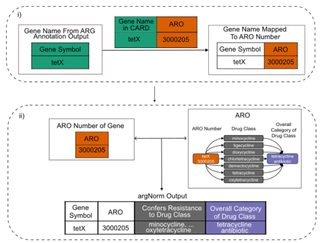

# argNorm: Normalize ARG annotations to the ARO

[](https://github.com/BigDataBiology/argNorm/actions/workflows/python-package.yml)
[](https://pepy.tech/project/argNorm)

[](http://bioconda.github.io/recipes/argnorm/README.html)
[](https://anaconda.org/bioconda/argnorm)
[](https://anaconda.org/bioconda/argnorm)

## What is argNorm?
argNorm is a tool to normalize antibiotic resistance genes (ARGs) by mapping them to the [antibiotic resistance ontology (ARO)](https://obofoundry.org/ontology/aro.html) created by the [CARD database](https://card.mcmaster.ca/).

argNorm also enhances antibiotic resistance gene annotations by providing drug categorization of the drugs that antibiotic resistance genes confer resistance to.

## Why argNorm?

Right now, many tools exist for annotation ARGs in genomes and metagenomes. However, each tools will have distinct output formats.

The [hAMRonization package](https://github.com/pha4ge/hAMRonization) can normalize file formats, but each tool will use different names/identifiers (_e.g._, `TetA` or `TETA` or `tet(A)` or `tet-A` are all different ways to spell the same gene name).

For a small number of isolate genomes, a human user can manually evaluate the outputs. However, in metagnomics, especially for large-scale projects, this becomes infeasible. Thus argNorm normalizers the output vocabulary of ARG annotation tools by mapping them to the same ontology (ARO).

Besides performing normalization, argNorm also provides categorization of drugs that antibiotic resistance genes confer resistance to. 

For example, the `PBP2b` (`ARO:3003042`) gene confers resistance to the drug class `amoxicillin`. `amoxicillin` is then categorized into a broader category of `beta lactam antibiotic`.

argNorm provides support for this, and adds the `confers_resistance_to` and `resistance_to_drug_classes` columns to ARG annotations.

The `confers_resistance_to` column will contain ARO numbers of all the drug classes that a gene provides resistance to (`ARO:0000064` for `amoxicillin` in the previous example).

The `resistance_to_drug_classes` column will contain ARO numbers of the broader categories of the drug classes in the `confers_resistance_to` column (`ARO:3000007` for `beta lactam antibiotic` in the previous example).

## argNorm workflow

*Schematic illustration of argNorm workflow through a Resfinder output example: mapping gene names in the ARG annotation outputs to gene names from the ARO mapped ARG databases and adding corresponding drug categorization, namely “confers resistance to immediate drug class” and “overall category of drug class”, from the ARO ontology file.*



## Supported tools

- [DeepARG](https://bench.cs.vt.edu/deeparg) (v1.0.2)
- [ARGs-OAP](https://galaxyproject.org/use/args-oap/) (v3)
- [ABRicate](https://github.com/tseemann/abricate) (v1.0.1) with NCBI (v3.6), ResFinder (v4.1.11), MEGARes (v2.0), ARG-ANNOT (v5), ResFinderFG (v2)
- [ResFinder](https://bitbucket.org/genomicepidemiology/resfinder/src/master/) (v4.0)
- [AMRFinderPlus](https://github.com/ncbi/amr) (v3.10.30)

## Installation
argNorm can be installed using pip:
```bash
pip install argnorm
```

argNorm can also be installed through conda:
```
conda install bioconda::argnorm
```

## Tutorial video

[](https://youtu.be/vx8MCQ7gDLs)

## Basic usage

The only positional argument required is `tool` which can be:
- `deeparg`
- `argsoap`
- `abricate`
- `resfinder`
- `amrfinderplus`

The available options are:
- `-h` or `--help`: shows available options and exits.
- `--db`: database used to perform ARG annotation. Supported databases are:
    - SARG (`sarg`)
    - NCBI (`ncbi`)
    - ResFinder (`resfinder`)
    - DeepARG (`deeparg`)
    - MEGARes (`megares`)
    - ARG-ANNOT (`argannot`)
- `--hamronized`: use this if the input is hamronized by [hAMRonization](https://github.com/pha4ge/hAMRonization)
- `-i` or `--input`: path to the annotation result
- `-o` or `--output`: the file to save normalization results

Use `argnorm -h` or `argnorm --help` to see available options.

```bash
>argnorm -h
usage: argnorm [-h] [--db {sarg,ncbi,resfinder,deeparg,megares,argannot}] [--hamronized] [-i INPUT] [-o OUTPUT] {argsoap,abricate,deeparg,resfinder,amrfinderplus}

argNorm normalizes ARG annotation results from different tools and databases to the same ontology, namely ARO (Antibiotic Resistance Ontology).

positional arguments:
  {argsoap,abricate,deeparg,resfinder,amrfinderplus}
                        The tool you used to do ARG annotation.

options:
  -h, --help            show this help message and exit
  --db {sarg,ncbi,resfinder,deeparg,megares,argannot}
                        The database you used to do ARG annotation.
  --hamronized          Use this if the input is hamronized (processed using the hAMRonization tool)
  -i INPUT, --input INPUT
                        The annotation result you have
  -o OUTPUT, --output OUTPUT
                        The file to save normalization results
```

Here is a basic outline of calling argNorm.

```bash
argnorm [tool] -i [original_annotation.tsv] -o [annotation_result_with_aro.tsv]
```

## Example 1: argNorm as a command line tool

Here is a quick demo of running argNorm on the command line.

### Step 1: Install argNorm

Install argNorm and check installation
```
pip install argnorm
argnorm -h
```

`argnorm -h` or `argnorm --help` will display all the available options to run argNorm with.

```
> argnorm -h
usage: argnorm [-h]
               [--db {sarg,ncbi,resfinder,deeparg,megares,argannot,resfinderfg}]
               [--hamronized] [-i INPUT] [-o OUTPUT]
               {argsoap,abricate,deeparg,resfinder,amrfinderplus}

argNorm normalizes ARG annotation results from different tools and databases to the same ontology, namely ARO (Antibiotic Resistance Ontology).

positional arguments:
  {argsoap,abricate,deeparg,resfinder,amrfinderplus}
                        The tool you used to do ARG annotation.

optional arguments:
  -h, --help            show this help message and exit
  --db {sarg,ncbi,resfinder,deeparg,megares,argannot,resfinderfg}
                        The database you used to do ARG annotation.
  --hamronized          Use this if the input is hamronized (processed using
                        the hAMRonization tool)
  -i INPUT, --input INPUT
                        The annotation result you have
  -o OUTPUT, --output OUTPUT
                        The file to save normalization results
```

### Step 2: Create working directory & download sample data

argNorm adds ARO mappings and drug categories as additional columns to the outputs of ARG annotation tools.

For this example, we will run argNorm on the ARG annotation output from the [ResFinder](https://bitbucket.org/genomicepidemiology/resfinder/src/master/) tool (with the [ResFinder database](https://bitbucket.org/genomicepidemiology/resfinder_db/raw/8aad1d20603fbec937cdae55024568de6dbd609f/all.fsa)). 

Create a folder called `argNorm_tutorial` and store the downloaded data file in it. Navigate into the `argNorm_tutorial` folder.

```
mkdir argNorm_tutorial
cd argNorm_tutorial
```

Click [here](https://raw.githubusercontent.com/BigDataBiology/argNorm/main/examples/raw/resfinder.resfinder.orfs.tsv) to download the input data.

If you are on Linux:
```
wget https://raw.githubusercontent.com/BigDataBiology/argNorm/main/examples/raw/resfinder.resfinder.orfs.tsv
```

### Step 3: Running argNorm

Here is a basic outline of most argNorm commands:

```bash
argnorm [tool] -i [original_annotation.tsv] -o [argnorm_result.tsv] [--hamronized]
```

Here, `tool` refers to the ARG annotation tool used (ResFinder in this case). `original_annotation.tsv` is the path to the input data and `argnorm_result.tsv` is the path to output file where the resulting table from argNorm will be stored. `--hamronized` is an option to indicate if the input data is a result of using the [hAMRonization package](https://github.com/pha4ge/hAMRonization). In our example, the input data is not a result of using the hAMRonization package, and so the `--hamronized` option can be omitted.


To run argNorm on the input data, use this command in your terminal:

```
argnorm resfinder -i ./resfinder.resfinder.orfs.tsv -o ./resfinder.resfinder.orfs.normed.tsv
```

The argNorm result will be stored in the file `resfinder.resfinder.orf.normed.tsv`.

## Example 2: argNorm as a Python library

### Code

Save this piece of Python code to a file called `argnorm_tutorial.py`

```
# Import from argNorm
from argnorm.lib import map_to_aro
from argnorm.drug_categorization import confers_resistance_to, drugs_to_drug_classes

# Creating a list of input genes to be mapped to the ARO
list_of_input_genes = ['sul1_2_U12338', 'sul1_3_EU855787', 'sul2_1_AF542061']

# The database from which the `list_of_input_genes` was created is the ResFinder database
database = 'resfinder'

# Looping through `list_of_input` genes and mapping each gene to the ARO
# Storing each ARO mapping in the `list_of_aros` list
list_of_aros = []
for gene in list_of_input_genes:
    # Using `id` attribute to get ARO number
    # `name` attribute can be used to get name of gene in ARO
    list_of_aros.append(map_to_aro(gene, database).id)
print(list_of_aros)

# Looping through `list_of_aros` and finding the drugs to which the each ARO confers resistance to
# Storing each drug in the `list_of_drugs` list
list_of_drugs = []
for aro in list_of_aros:
    list_of_drugs.append(confers_resistance_to(aro))
print(list_of_drugs)

# Looping through `list_of_drugs` and finding the superclass/drug class of each drug
# Storing each superclass/drug class in the `list_of_drug_classes` list
list_of_drug_classes = []
for drug in list_of_drugs:
    list_of_drug_classes.append(drugs_to_drug_classes(drug))
print(list_of_drug_classes)
```

### Explanation

To use argNorm as a library, we must first import it in our Python file:

```
from argnorm.lib import map_to_aro
from argnorm.drug_categorization import confers_resistance_to, drugs_to_drug_classes
```

The `lib` module contains the function `map_to_aro` which will return the ARO number of a particular antibiotic resistance gene. The `drug_categorization` module contains the functions `confers_resistance_to` and `drugs_to_drug_classes`. The `confers_resistance_to` function returns the drugs to which a gene confers resistance to. The `drugs_to_drug_classes` function returns the drug class to which a specific drug belongs.

The `map_to_aro` function takes two arguments: `gene` and `database`. `gene` is the name of an antibiotic resistance gene. `database` is the database from which `gene` is taken from.

In this example, a list of genes from the ResFinder database is used, and `map_to_aro` maps each gene in the list to an ARO term. 

The ARO numbers from the ARO terms are also stored in the `list_of_aros` list. The ARO numbers can be accessed using the `id` attribute of the ARO terms. The names of the gene of the ARO terms an be accessed using the `name` attribute.

```
database = 'resfinder'

list_of_aros = []
for gene in list_of_input_genes:
    list_of_aros.append(map_to_aro(gene, database).id)
print(list_of_aros)
```

Once a list of ARO numbers is created for each gene, the `confers_resistance_to` function can be used on each ARO number to create a list of drugs to which each gene/ARO confers resistance to:

```
list_of_drugs = []
for aro in list_of_aros:
    list_of_drugs.append(confers_resistance_to(aro))
print(list_of_drugs)
```

Now, each drug in the `list_of_drugs` can be categorized into a broader drug category using the `drugs_to_drug_classes` function:

```
list_of_drug_classes = []
for drug in list_of_drugs:
    list_of_drug_classes.append(drugs_to_drug_classes(drug))
print(list_of_drug_classes)
```

### Output

```
List of ARO numbers
['ARO:3000410', 'ARO:3000410', 'ARO:3000412']

Confers resistance to
[['ARO:3000324', 'ARO:3000325', 'ARO:3000327', 'ARO:3000329', 'ARO:3000330', 'ARO:3000683', 'ARO:3000684', 'ARO:3000698', 'ARO:3000699'], ['ARO:3000324', 'ARO:3000325', 'ARO:3000327', 'ARO:3000329', 'ARO:3000330', 'ARO:3000683', 'ARO:3000684', 'ARO:3000698', 'ARO:3000699'], ['ARO:3000324', 'ARO:3000325', 'ARO:3000327', 'ARO:3000329', 'ARO:3000330', 'ARO:3000683', 'ARO:3000684', 'ARO:3000698', 'ARO:3000699']]

Resistance to drug classes
[['ARO:3000282', 'ARO:3000282', 'ARO:3000282', 'ARO:3000282', 'ARO:3000282', 'ARO:3000282', 'ARO:3000282', 'ARO:3000282', 'ARO:3000282'], ['ARO:3000282', 'ARO:3000282', 'ARO:3000282', 'ARO:3000282', 'ARO:3000282', 'ARO:3000282', 'ARO:3000282', 'ARO:3000282', 'ARO:3000282'], ['ARO:3000282', 'ARO:3000282', 'ARO:3000282', 'ARO:3000282', 'ARO:3000282', 'ARO:3000282', 'ARO:3000282', 'ARO:3000282', 'ARO:3000282']]
```

## Authors

- Vedanth Ramji [vedanth.ramji@gmail.com](mailto:vedanth.ramji@gmail.com)*
- Hui Chong [huichong.me@gmail.com](mailto:huichong.me@gmail.com)
- Svetlana Ugarcina Perovic [svetlana.ugarcina@gmail.com](mailto:svetlana.ugarcina@gmail.com)
- Finlay Maguire [finlaymaguire@gmail.com](mailto:finlaymaguire@gmail.com)
- [Luis Pedro Coelho](https://luispedro.org) [luis@luispedro.org](mailto:luis@luispedro.org)

*: current maintainer