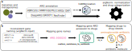

# argNorm: Normalize ARG annotations to the ARO

[](https://github.com/BigDataBiology/argNorm/actions/workflows/python-package.yml)
[](https://pepy.tech/project/argNorm)

[](http://bioconda.github.io/recipes/argnorm/README.html)
[](https://anaconda.org/bioconda/argnorm)
[](https://anaconda.org/bioconda/argnorm)

## argNorm Overview


*General overview of argNorm. (a) Genomes and metagenomes can be annotated using ARG annotation tools. argNorm accepts the outputs of these ARG annotation tools directly or after the outputs are processed by hAMRonization to perform ARO normalization and drug categorization. (b) The argNorm workflow includes: mapping gene names in the ARG annotation outputs to ARO accessions from ARO annotation tables constructed using RGI and manual curation; and mapping gene ARO accessions to drugs and drugs classes. In categorizing drugs, argNorm reports the immediate child of the ‘antibiotic molecule’ node. Tobramycin is an example of a drug to which the ANT(2'')-Ia gene confers resistance to and tobramycin can be categorized as an aminoglycoside antibiotic. The ‘confers_resistance_to_antibiotic’ and is_a relationships are used to navigate the ARO.*

[](https://youtu.be/SnDy-to5iok)

*argNorm presented at the Microbiome Virtual International Forum*

## argNorm workflow


*Schematic illustration of argNorm workflow through a Resfinder output example: mapping gene names in the ARG annotation outputs to gene names from the ARO mapped ARG databases and adding corresponding drug categorization, namely “confers resistance to immediate drug class” and “overall category of drug class”, from the ARO ontology file.*

## What is argNorm?
argNorm is a tool to normalize antibiotic resistance genes (ARGs) by mapping them to the [antibiotic resistance ontology (ARO)](https://obofoundry.org/ontology/aro.html) created by the [CARD database](https://card.mcmaster.ca/).

argNorm also enhances antibiotic resistance gene annotations by providing drug categorization of the drugs that antibiotic resistance genes confer resistance to.

## Why argNorm?

Right now, many tools exist for annotation ARGs in genomes and metagenomes. However, each tools will have distinct output formats.

The [hAMRonization package](https://github.com/pha4ge/hAMRonization) can normalize file formats, but each tool will use different names/identifiers (_e.g._, `TetA` or `TETA` or `tet(A)` or `tet-A` are all different ways to spell the same gene name).

For a small number of isolate genomes, a human user can manually evaluate the outputs. However, in metagnomics, especially for large-scale projects, this becomes infeasible. Thus argNorm normalizes the output vocabulary of ARG annotation tools by mapping them to the same ontology (ARO).

Besides performing normalization, argNorm also provides categorization of drugs that antibiotic resistance genes confer resistance to. 

For example, the `PBP2b` (`ARO:3003042`) gene confers resistance to the drug class `amoxicillin`. `amoxicillin` is then categorized into a broader category of `beta lactam antibiotic`.

argNorm provides support for this, and adds the `confers_resistance_to` and `resistance_to_drug_classes` columns to ARG annotations.

The `confers_resistance_to` column will contain ARO numbers of all the drug classes that a gene provides resistance to (`ARO:0000064` for `amoxicillin` in the previous example).

The `resistance_to_drug_classes` column will contain ARO numbers of the broader categories of the drug classes in the `confers_resistance_to` column (`ARO:3000007` for `beta lactam antibiotic` in the previous example).

### argNorm Preprint
**You can read the preprint detailing argNorm here: https://eprints.qut.edu.au/252448/**

If you use argNorm in a publication, please cite the preprint:
> Ugarcina Perovic S, Ramji V et al. argNorm: Normalization of Antibiotic Resistance Gene Annotations to the Antibiotic Resistance Ontology (ARO). Queensland University of Technology ePrints, 2024. DOI: https://doi.org/10.5204/rep.eprints.252448 [Preprint] (Under review).

## Supported ARG annotation tools and databases

| ARG database                       | Tool for ARG annotation                                 |
| ---------------------------------- | ------------------------------------------------------- |
| ARG-ANNOT v5.0                     | [ABRicate v1.0.1](https://github.com/tseemann/abricate) & [hAMRonization](https://github.com/pha4ge/hAMRonization) |
| DeepARG v2                         | [DeepARG v1.0.2](https://bench.cs.vt.edu/deeparg) & [hAMRonization](https://github.com/pha4ge/hAMRonization)       |
| Groot v1.1.2                       | [GROOT v1.1.2](https://github.com/will-rowe/groot) & [hAMRonization](https://github.com/pha4ge/hAMRonization)      |
| MEGARes v3.0                       | [ABRicate v1.0.1](https://github.com/tseemann/abricate) & [hAMRonization](https://github.com/pha4ge/hAMRonization) |
| NCBI Reference Gene Database v3.12 and v4.0 | [ABRicate v1.0.1](https://github.com/tseemann/abricate), [AMRFinderPlus v3.10.30 and v4.0.19](https://github.com/ncbi/amr), & [hAMRonization](https://github.com/pha4ge/hAMRonization) |
| ResFinder v4.0                     | [ABRicate v1.0.1](https://github.com/tseemann/abricate), [ResFinder v4.0](https://bitbucket.org/genomicepidemiology/resfinder/src/master/), & [hAMRonization](https://github.com/pha4ge/hAMRonization) |
| ResFinderFG v2.0                   | [ABRicate v1.0.1](https://github.com/tseemann/abricate) & [hAMRonization](https://github.com/pha4ge/hAMRonization) |
| SARG (reads mode) v3.2.1           | [ARGs-OAP v2.3](https://galaxyproject.org/use/args-oap/) & [hAMRonization](https://github.com/pha4ge/hAMRonization)  | 

- Note: ARG database and ARG annotation tool versions can change. argNorm currently only supports versions listed above.
- Note: the argNorm tool will be periodically updated to support the latest versions of databases and annotation tools if they undergo significant changes.
> hAMRonization: argNorm does not support ALL hAMRonized results. **argNorm only supports hAMRonization outputs that were obtained by passing the outputs of the supported ARG annotation tools listed above into hAMRonization**

## Installation
argNorm can be installed using pip:
```bash
pip install argnorm
```

argNorm can also be installed through conda:
```
conda install bioconda::argnorm
```

## Nextflow and funcscan
argNorm is also available as an [nf-core module](https://nf-co.re/modules/argnorm/). If using an nf-core pipeline, argNorm can be installed using:
```
nf-core modules install argnorm
```

argNorm is readily available in the funcscan pipeline which can be accessed (here)[https://github.com/nf-core/funcscan]

## Tutorial video

[](https://youtu.be/vx8MCQ7gDLs)

## CLI Usage

> For detailed examples of running the argNorm CLI see [here](./docs/cli.md)

Here is a basic outline of calling argNorm.

```bash
argnorm [tool] [--db] -i [path to original_annotation.tsv] -o [path to annotation_result_with_aro.tsv] [----hamronization_skip_unsupported_tool]
```

**Resource requirements**: argNorm takes a few seconds to run (even for 1,000s of input genes) and requires only _ca_ 200MiB of RAM.

### `tool` (required)
The most important ***required positional*** argument is `tool` (see [here](#supported-tools-and-databases) for the specific versions of supported tools):
- `deeparg`
- `argsoap`
- `abricate`
- `resfinder`
- `amrfinderplus`
- `groot`
- `hamronization`

### I/O (required)
- `-i` or `--input`: path to the annotation result
- `-o` or `--output`: the file to save normalization results

### `--db` (*optional*)
This is the ARG database used to perform annotation:
- `sarg`
- `ncbi`
- `resfinder`
- `deeparg`
- `megares`
- `argannot`
- `groot-core-db`, `groot-db`, `groot-resfinder`, `groot-argannot`, `groot-card`

#### **`--db` vs `tool`**
ARG annotation tools can use several ARG databases for annotation. Hence, the `tool` is a required argument while `--db` is mostly optional. For some tools, however, specifiying `--db` is **required**, see below:

| `tool`          | `--db`       |
| --------------- | ------------ |
| `deeparg`       | Not required |
| `argsoap`       | Not required |
| `abricate`      | Any from `ncbi`, `deeparg`, `resfinder`, `sarg`, `megares`, `argannot`, or `resfinderfg` |
| `resfinder`     | Not required |
| `amrfinderplus` | Not required |
| `groot`         | Any from `groot-argannot`, `groot-resfinder`, `groot-db`, `groot-core-db`, or `groot-card` |
| `hamronization` | Not required |

### `--hamronization_skip_unsupported_tool` (*optional*)
Combined hamronization results can have ARGs detected by unsupported tools (e.g. staramr). By default, argNorm throws an exception as these are unsupported tools, however, `--hamronization_skip_unsupported_tool` allows users to skip rows with unsupported tools. A warning will be raised rather than an exception.

### `-h` or `--help`
Use `argnorm -h` or `argnorm --help` to see available options.

```bash
>argnorm -h
usage: argnorm [-h] [--db {argannot,deeparg,megares,ncbi,resfinder,resfinderfg,sarg,groot-db,groot-core-db,groot-argannot,groot-resfinder,groot-card}]
               [-i INPUT] [--hamronized] [--hamronization_skip_unsupported_tool] [-o OUTPUT]
               {argsoap,abricate,deeparg,resfinder,amrfinderplus,groot,hamronization}

argNorm normalizes ARG annotation results from different tools and databases to the same ontology, namely ARO (Antibiotic Resistance Ontology).

positional arguments:
  {argsoap,abricate,deeparg,resfinder,amrfinderplus,groot,hamronization}
                        The tool you used to do ARG annotation.

options:
  -h, --help            show this help message and exit
  --db {argannot,deeparg,megares,ncbi,resfinder,resfinderfg,sarg,groot-db,groot-core-db,groot-argannot,groot-resfinder,groot-card}
                        The database you used to do ARG annotation.
  -i INPUT, --input INPUT
                        The annotation result you have
  --hamronized          Use hamronization as a tool instead
  --hamronization_skip_unsupported_tool
                        Skip rows with unsupported tools for hamronization outputs
  -o OUTPUT, --output OUTPUT
                        The file to save normalization results
```

## Outputs
The following columns are added to the tsv outputs of ARG annotation tools:
| Table column                 | Description                                                                      |
| ---------------------------- | -------------------------------------------------------------------------------- |
| `ARO`                        | ARO accessions of ARG                                                            |
| `confers_resistance_to`      | ARO accessions of drugs to which ARGs confer resistance to                       |
| `resistance_to_drug_classes` | ARO accessions of drugs classes to which drugs in `confers_resistance_to` belong |
| `Cut_Off`                    | RGI cut-off scores for ARO mappings. If manually curated, cut-off score is `Manual`|

A comment is added to the very top of the ARG annotation tool outputs specifying the argNorm version used if ran on the command line. For example:

~~~
# argNorm version: 0.6.0
input_sequence_id	input_file_name	gene_symbol	gene_name	reference_database_id ...
. REST OF ARG ANNOTATION OUTPUT TSV TABLE
.
.
~~~

> **NOTE: This is only if argNorm is used on the CLI, if you used argNorm's normalizers there will be no comment with the argNorm version**
 
> **NOTE: THIS WILL BREAK ANY PREVIOUS SCRIPTS ANALYZING ARGNORM CLI OUTPUTS BEFORE THIS UPDATE! PLEASE USE THE `skiprows=1` ARGUMENT WHEN LOADING ARGNORM OUTPUT DATAFRAMES TO IGNORE THE COMMENT WITH THE ARGNORM VERSION AS SHOWN BELOW:**
> ```
> import pandas as pd
> df = pd.read_csv(<PATH TO ARGNORM OUTPUT>, sep='\t', skiprows=1)
> ```

### `Cut_Off` column

- Cut-off scores are procured from RGI outputs after running input databases through RGI. These cut-off scores correspond to RGI's Discovery paradigm (learn more here: https://github.com/arpcard/rgi/blob/master/docs/rgi_main.rst).
- RGI's cut-off scores are of three types: `Loose`, `Strict`, and `Perfect`.
- argNorm also adds another score, `Manual`, to signify genes that are mapped to ARO terms manually without using RGI.

From RGI documentation (https://github.com/arpcard/rgi/blob/master/docs/rgi_main.rst):
> The RGI analyzes genome or proteome sequences under a Perfect, Strict, and Loose (a.k.a. Discovery) paradigm. The Perfect algorithm is most often applied to clinical surveillance as it detects perfect matches to the curated reference sequences in CARD. In contrast, the Strict algorithm detects previously unknown variants of known AMR genes, including secondary screen for key mutations, using detection models with CARD's curated similarity cut-offs to ensure the detected variant is likely a functional AMR gene. The Loose algorithm works outside of the detection model cut-offs to provide detection of new, emergent threats and more distant homologs of AMR genes, but will also catalog homologous sequences and spurious partial matches that may not have a role in AMR. Combined with phenotypic screening, the Loose algorithm allows researchers to hone in on new AMR genes.
>
> Within the Perfect, Strict, and Loose paradigm, RGI currently supports CARD's protein homolog models, protein variant models, protein over-expression models, and rRNA mutation models:
> 
> Protein Homolog Models (PHM) detect protein sequences based on their similarity to a curated reference sequence, using curated BLASTP bitscore cut-offs, for example NDM-1. Protein Homolog Models apply to all genes that confer resistance through their presence in an organism, such as the presence of a beta-lactamase gene on a plasmid. PHMs include a reference sequence and a bitscore cut-off for detection using BLASTP. A Perfect RGI match is 100% identical to the reference protein sequence along its entire length, a Strict RGI match is not identical but the bit-score of the matched sequence is greater than the curated BLASTP bit-score cutoff, Loose RGI matches have a bit-score less than the curated BLASTP bit-score cut-off.

## Example 1: argNorm as a command line tool

Here is a quick demo of running argNorm on the command line.

### Step 1: Install argNorm

Install argNorm and check installation
```
pip install argnorm
argnorm -h
```

`argnorm -h` or `argnorm --help` will display all the available options to run argNorm with.

```
> argnorm -h
usage: argnorm [-h] [--db {argannot,deeparg,megares,ncbi,resfinder,resfinderfg,sarg,groot-db,groot-core-db,groot-argannot,groot-resfinder,groot-card}]
               [-i INPUT] [--hamronized] [--hamronization_skip_unsupported_tool] [-o OUTPUT]
               {argsoap,abricate,deeparg,resfinder,amrfinderplus,groot,hamronization}

argNorm normalizes ARG annotation results from different tools and databases to the same ontology, namely ARO (Antibiotic Resistance Ontology).

positional arguments:
  {argsoap,abricate,deeparg,resfinder,amrfinderplus,groot,hamronization}
                        The tool you used to do ARG annotation.

options:
  -h, --help            show this help message and exit
  --db {argannot,deeparg,megares,ncbi,resfinder,resfinderfg,sarg,groot-db,groot-core-db,groot-argannot,groot-resfinder,groot-card}
                        The database you used to do ARG annotation.
  -i INPUT, --input INPUT
                        The annotation result you have
  --hamronized          Use hamronization as a tool instead
  --hamronization_skip_unsupported_tool
                        Skip rows with unsupported tools for hamronization outputs
  -o OUTPUT, --output OUTPUT
                        The file to save normalization results
```

### Step 2: Create working directory & download sample data

argNorm adds ARO mappings and drug categories as additional columns to the outputs of ARG annotation tools.

For this example, we will run argNorm on the ARG annotation output from the [ResFinder](https://bitbucket.org/genomicepidemiology/resfinder/src/master/) tool (with the [ResFinder database](https://bitbucket.org/genomicepidemiology/resfinder_db/raw/8aad1d20603fbec937cdae55024568de6dbd609f/all.fsa)). 

Create a folder called `argNorm_tutorial` and store the downloaded data file in it. Navigate into the `argNorm_tutorial` folder.

```
mkdir argNorm_tutorial
cd argNorm_tutorial
```

Click [here](https://raw.githubusercontent.com/BigDataBiology/argNorm/main/examples/raw/resfinder.resfinder.orfs.tsv) to download the input data.

If you are on Linux:
```
wget https://raw.githubusercontent.com/BigDataBiology/argNorm/main/examples/raw/resfinder.resfinder.orfs.tsv
```

### Step 3: Running argNorm

Here is a basic outline of most argNorm commands:

```bash
argnorm [tool] -i [original_annotation.tsv] -o [argnorm_result.tsv] [--db]
```

Here, `tool` refers to the ARG annotation tool used (ResFinder in this case). `original_annotation.tsv` is the path to the input data and `argnorm_result.tsv` is the path to output file where the resulting table from argNorm will be stored. `--db` is the ARG databases used along with `tool` to perform annotation. ResFinder does not require a `--db` (argNorm will automatically load up the ResFinder database), however, `--db` is required for the ARG annotation tools `groot` and `abricate`.


To run argNorm on the input data, use this command in your terminal:

```
argnorm resfinder -i ./resfinder.resfinder.orfs.tsv -o ./resfinder.resfinder.orfs.normed.tsv
```

The argNorm result will be stored in the file `resfinder.resfinder.orf.normed.tsv`.

## Example 2: argNorm as a Python library

### Code

Save this piece of Python code to a file called `argnorm_tutorial.py`

```
# Import from argNorm
from argnorm.lib import map_to_aro
from argnorm.drug_categorization import confers_resistance_to, drugs_to_drug_classes

# Creating a list of input genes to be mapped to the ARO
list_of_input_genes = ['sul1_2_U12338', 'sul1_3_EU855787', 'sul2_1_AF542061']

# The database from which the `list_of_input_genes` was created is the ResFinder database
database = 'resfinder'

# Looping through `list_of_input` genes and mapping each gene to the ARO
# Storing each ARO mapping in the `list_of_aros` list
list_of_aros = []
for gene in list_of_input_genes:
    # Using `id` attribute to get ARO number
    # `name` attribute can be used to get name of gene in ARO
    list_of_aros.append(map_to_aro(gene, database).id)
print(list_of_aros)

# Looping through `list_of_aros` and finding the drugs to which the each ARO confers resistance to
# Storing each drug in the `list_of_drugs` list
list_of_drugs = []
for aro in list_of_aros:
    list_of_drugs.append(confers_resistance_to(aro))
print(list_of_drugs)

# Looping through `list_of_drugs` and finding the superclass/drug class of each drug
# Storing each superclass/drug class in the `list_of_drug_classes` list
list_of_drug_classes = []
for drug in list_of_drugs:
    list_of_drug_classes.append(drugs_to_drug_classes(drug))
print(list_of_drug_classes)
```

### Explanation

To use argNorm as a library, we must first import it in our Python file:

```
from argnorm.lib import map_to_aro
from argnorm.drug_categorization import confers_resistance_to, drugs_to_drug_classes
```

The `lib` module contains the function `map_to_aro` which will return the ARO number of a particular antibiotic resistance gene. The `drug_categorization` module contains the functions `confers_resistance_to` and `drugs_to_drug_classes`. The `confers_resistance_to` function returns the drugs to which a gene confers resistance to. The `drugs_to_drug_classes` function returns the drug class to which a specific drug belongs.

The `map_to_aro` function takes two arguments: `gene` and `database`. `gene` is the name of an antibiotic resistance gene. `database` is the database from which `gene` is taken from.

In this example, a list of genes from the ResFinder database is used, and `map_to_aro` maps each gene in the list to an ARO term. 

The ARO numbers from the ARO terms are also stored in the `list_of_aros` list. The ARO numbers can be accessed using the `id` attribute of the ARO terms. The names of the gene of the ARO terms an be accessed using the `name` attribute.

```
database = 'resfinder'

list_of_aros = []
for gene in list_of_input_genes:
    list_of_aros.append(map_to_aro(gene, database).id)
print(list_of_aros)
```

Once a list of ARO numbers is created for each gene, the `confers_resistance_to` function can be used on each ARO number to create a list of drugs to which each gene/ARO confers resistance to:

```
list_of_drugs = []
for aro in list_of_aros:
    list_of_drugs.append(confers_resistance_to(aro))
print(list_of_drugs)
```

Now, each drug in the `list_of_drugs` can be categorized into a broader drug category using the `drugs_to_drug_classes` function:

```
list_of_drug_classes = []
for drug in list_of_drugs:
    list_of_drug_classes.append(drugs_to_drug_classes(drug))
print(list_of_drug_classes)
```

### Output

```
List of ARO numbers
['ARO:3000410', 'ARO:3000410', 'ARO:3000412']

Confers resistance to
[['ARO:3000324', 'ARO:3000325', 'ARO:3000327', 'ARO:3000329', 'ARO:3000330', 'ARO:3000683', 'ARO:3000684', 'ARO:3000698', 'ARO:3000699'], ['ARO:3000324', 'ARO:3000325', 'ARO:3000327', 'ARO:3000329', 'ARO:3000330', 'ARO:3000683', 'ARO:3000684', 'ARO:3000698', 'ARO:3000699'], ['ARO:3000324', 'ARO:3000325', 'ARO:3000327', 'ARO:3000329', 'ARO:3000330', 'ARO:3000683', 'ARO:3000684', 'ARO:3000698', 'ARO:3000699']]

Resistance to drug classes
[['ARO:3000282', 'ARO:3000282', 'ARO:3000282', 'ARO:3000282', 'ARO:3000282', 'ARO:3000282', 'ARO:3000282', 'ARO:3000282', 'ARO:3000282'], ['ARO:3000282', 'ARO:3000282', 'ARO:3000282', 'ARO:3000282', 'ARO:3000282', 'ARO:3000282', 'ARO:3000282', 'ARO:3000282', 'ARO:3000282'], ['ARO:3000282', 'ARO:3000282', 'ARO:3000282', 'ARO:3000282', 'ARO:3000282', 'ARO:3000282', 'ARO:3000282', 'ARO:3000282', 'ARO:3000282']]
```

## API Reference

Click [here](./docs/api.md) to view the API Reference

## Authors

- Vedanth Ramji [vedanth.ramji@gmail.com](mailto:vedanth.ramji@gmail.com)*
- Hui Chong [huichong.me@gmail.com](mailto:huichong.me@gmail.com)
- Svetlana Ugarcina Perovic [svetlana.ugarcina@gmail.com](mailto:svetlana.ugarcina@gmail.com)
- Finlay Maguire [finlaymaguire@gmail.com](mailto:finlaymaguire@gmail.com)
- [Luis Pedro Coelho](https://luispedro.org) [luis@luispedro.org](mailto:luis@luispedro.org)

*: current maintainer
